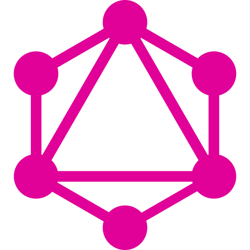

# basketball-simulation

# Banners

# Deployed Application
 - ### [Basketball Simulator](https://basketball-simulator-zja.herokuapp.com/)

# Table of Contents
- [Technologies](#Technologies)
- [Description](#Description)
- [Simulation](#Simulation)
- [How to Play](#How-to-Play)
- [Screenshots](#Screenshots)
- [Contact Information](#Contact-Information)
- [Icon References](#Icon-References)

# Technologies

# Description
***Basketball Simulator*** is a full stack web application that allows a user to build a 5 man basketball team using the 2015-2016 Cleveland Caveliers and GolderState Warriors championship finals starting roster and play against a randomly generated basketball team out of the same players. When a user builds a team that team is stored on the users profile in a MongoDB database. Additionally, all the stats for a game are stored in the same database and a user can access all of their 30 most recent games on their profile. 

Each users record (wins, losses, and win percentage) are kept in the database and used to provide leaderboards for the top 50 most total win users and top 50 highest win percentage users.

# Simulation
The simulation works by taking each players game average stats over a season; shot attempts, shot % to make, offensive/defensive rebounds, etc. These stats are then used to run a game that mirrors these stats. For example if Steph Curry is on your team and shoots 16.3 shots each game and the rest of your team combined shoots 46.5 shots per game then every time a ball is shot there is a 25.9% chance that Steph Curry will shoot it. This concept applies to the rebounds as well whenever a shot is missed. With rebounds however it takes into account offensive vs defensive rebounds for a team. If a team averages 10 offensive rebounds while the other team averages 30 defensive rebounds, then the offensive team has a 25% chance to get the rebound and attempt another shot.

When a player is chosen to shoot the simulation checks to see what percent of their shots are 2 point shots and 3 point shots. The player then shoots based on these percentages and has a chance to make their shot dependant on their respective 2 point % and 3 point %.

The game is split into 48 iterations, 1 iteration for every minute in a basketball game. Every iteration allows for each team to shoot a base amount of 1 shot. A player is chosen to shoot based on the percentages mentioned earlier. If a shot is missed then the rebound percentages talked of earlier are ran to see which team shoots the next shot. Only a maximum of 3 shots are allowed for each iteration. For example, team 1 can miss a shot, then team 2 gets the rebound and misses their shot, team 1 gets the rebound and misses their shot. In this case the simulation does not allow for another shot to be attempted and instead moves on to the next iteration.

# How to Play
To play the ***Basketball Simulator*** a user first must sign up and create a a profile. A unique username is needed and a password of atleast 6 characters are required. When a user first gets on the ***Basketball Simulator*** they will not have a team so they cannot play a game. 

To create a team the user must navigate to the marketplace tab, which can be accessed by clicking on the tab in the navbar that has a moneybag as an icon. Once at the marketplace a user can sign 5 players to their team by clicking on the 'draft' button on a player card. Once 5 players are selected the user can select the 'sign players' button to add the players to their team. If you do not have 5 players selected then nothing happens, you cannot add less than 5 players to your team. 

To run a simulated game the user must navigate to the play tab, which can be accessed by clicking on the tab in the navbar that has a basketball court as an icon. Once there, and if the user has a team created, the user can run a game by clicking on the 'play ai' button. As of right now you cannot play other users so the 'play user' button does not do anything. The stats for the game will propogate bellow and if you click on the team banner then the stats for the players on each team will be shown.

If the user goes to their profile page, which can be accessed by the tab in the navbar that has their first letter of their username for an icon, then they can see their wins, losses, and win percentage. Additionally, the 30 most recent games will be shown for the user, and if you click on a player name either on your current team list or in a prior game then the stats for that players most recent 30 games will be shown.

To review the current global leaderboards the user must navigate to the homepage tab, which can be accessed by the tab in the navbar that has a basketball as an icon. Once there the top 50 players with the most wins and the top 50 players with the highest percentage are displayed. In order to qualify for the leaderboards a user must have a minimum of 20 wins.

# Screenshots

# Contact Information (Sole Contributor)

Email: zarsement@hotmail.com \
Location: Beaumont, TX (Remote)

# Icon References
<a href="https://www.flaticon.com/free-icons/java" title="java icons">Java icons created by Pixel perfect - Flaticon</a>
<a href="https://www.flaticon.com/free-icons/react" title="react icons">React icons created by srip - Flaticon</a>
<a href="https://www.flaticon.com/free-icons/nodejs" title="nodejs icons">Nodejs icons created by Freepik - Flaticon</a>
<a href="https://www.flaticon.com/free-icons/css" title="css icons">Css icons created by Freepik - Flaticon</a>
<a href="https://www.flaticon.com/free-icons/html-5" title="html 5 icons">Html 5 icons created by Freepik - Flaticon</a>
